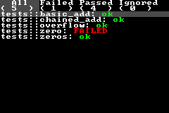

# gba_test

[](https://github.com/Anders429/gba_test/actions?query=branch%3Amaster)
[](https://crates.io/crates/gba_test)
[](https://docs.rs/gba_test)
[](#license)

Testing framework for the Game Boy Advance.



## Getting Started
Using `gba_test` requires a `nightly` Rust version.

### Prerequisites
- *ARM Binutils*: At minimum, you'll need the ARM GNU linker (`arm-none-eabi-ld`) to properly build projects using `gba_test`. You can obtain it from the [ARM website](https://developer.arm.com/Tools%20and%20Software/GNU%20Toolchain).
- *rust-src* - GBA development requires `build-std` to work. Run `rustup component add rust-src` to enable it.
- *`cargo` configuration* - Configuration for `cargo` should be provided in a `cargo/config.toml` file within your project. An example configuration is as follows:

```toml
[build]
target = "thumbv4t-none-eabi"

[target.thumbv4t-none-eabi]
runner = "mgba"
rustflags = ["-Clinker=arm-none-eabi-ld", "-Clink-arg=-Tgba.ld", "-Ztrap-unreachable=no"]

[unstable]
build-std = ["core"]
```

### Adding `gba_test` to your list of dependencies
In your `Cargo.toml` manifest, add `gba_test` to your list of dev-dependencies:

```toml
[package]
name = "your_project"
version = "0.1.0"
edition = "2021"

[dev-dependencies]
gba_test = "0.2.0"
```

### Running the test runner
`gba_test` provides its own test runner. To run the tests, you'll need to call the runner from your `main()` function.

The following code can be used to call the test runner when you run `cargo test`:

```rust
#![no_std]
#![cfg_attr(test, no_main)]
#![cfg_attr(test, feature(custom_test_frameworks))]
#![cfg_attr(test, test_runner(gba_test::runner))]
#![cfg_attr(test, reexport_test_harness_main = "test_harness")]

#[cfg(test)]
#[no_mangle]
pub fn main() {
    test_harness()
}
```

Calling `test_harness()` will run all tests defined within your project.

### Defining tests
`gba_test` provides its own custom `#[test]` attribute for defining tests. It works similar to the default `#[test]` attribute.

```rust
// A very simple function to test.
pub fn add(left: usize, right: usize) -> usize {
    left + right
}

#[cfg(test)]
mod tests {
    use super::add;
    use gba_test::test;

    #[test]
    fn it_works() {
        let result = add(2, 2);
        assert_eq!(result, 4);
    }
}
```

Other common testing attributes are also supported, including `#[ignore]` and `#[should_panic]`.

## Running Tests
`gba_test` can be run on anything that runs `.gba` files, ranging from original Game Boy Advance hardware to emulators.

### Configuring to run on mGBA with `cargo test`
For development workflows, it is recommended to run tests on an emulator. The example `cargo/config.toml` provided in the "Prerequisites" section will enable you to run tests on [mGBA](https://mgba.io/) (assuming `mgba` is in your PATH) when you run `cargo test`.

### Running on real hardware
To run on real Game Boy Advance hardware, you can flash the generated test binary to a cartridge.

#### Preparing a `.gba` file
When running `cargo test`, a `.elf` test binary is generated. Emulators like mGBA can run this `.elf` file, but real hardware requires a `.gba` file. The location of your test binary is output by `cargo test`. For example, running `cargo test` on the `gba_test` library itself outputs something like:

```
Running unittests src\lib.rs (target\thumbv4t-none-eabi\debug\deps\gba_test-5b5cf1bdf24b2915)
```

The path in the parenthesis is the location of the test binary. You can use `arm-none-eabi-objcopy` (obtained from the [ARM website](https://developer.arm.com/Tools%20and%20Software/GNU%20Toolchain)) to create a `.gba` file from this binary:

```
arm-none-eabi-objcopy -O binary target\thumbv4t-none-eabi\debug\deps\gba_test-5b5cf1bdf24b2915 test.gba
```

Next, run [`gbafix`](https://crates.io/crates/gbafix):

```
cargo install gbafix
gbafix test.gba
```

Now, `test.gba` is prepared to run on real Game Boy Advance hardware. See documentation for your flash cart for instructions on flashing the `.gba` file to the cartridge and running it.

### Running using `mgba-rom-test`
`gba_test` is configured to be run with the [`mgba-rom-test`](https://github.com/mgba-emu/mgba/blob/master/src/platform/test/rom-test-main.c) binary using SWI call `0x27` with `r0` as the output register. The following exit values may be emitted:
- `0` - A successful test run.
- `1` - One or more tests failed.
- `2` - The tests failed to complete. This indicates that a panic occurred outside of test execution.

To use `mgba-rom-test` in continuous integration with GitHub Actions, it is recommended to use the [`github-mgba-rom-test`](https://github.com/felixjones/github-mgba-rom-test) action. See this project's GitHub Actions setup for examples of this workflow.

## Logging
Some emulators, such as [mGBA](https://mgba.io/) or [no$gba](https://problemkaputt.de/gba.htm), support logging. `gba_test` provides optional integration with the [`log`](https://crates.io/crates/log) crate to log information about test running. You can enable logging through the log feature:

``` toml
[dev-dependencies]
gba_test = {version = "0.1.4", features = ["log"]}
```

You can also log within your tests using the `log` crate:

``` rust
use gba_test::test;

#[test]
fn foo() {
    log::info!("important information");
}
```

To produce the log output for your emulator, you'll need to use a logger implementation specific for that emulator's logging interface. The following logger implementations are recommended:

- mGBA: [`mgba_log`](https://crates.io/crates/mgba_log)
- no$gba: [`nocash_gba_log`](https://crates.io/crates/nocash_gba_log)

Initialize the logger prior to calling the test runner, like so:

``` rust
#![no_std]
#![cfg_attr(test, no_main)]
#![cfg_attr(test, feature(custom_test_frameworks))]
#![cfg_attr(test, test_runner(gba_test::runner))]
#![cfg_attr(test, reexport_test_harness_main = "test_harness")]

#[cfg(test)]
#[no_mangle]
pub fn main() {
    mgba_log::init();
    test_harness()
}
```

## License
This project is licensed under either of

* Apache License, Version 2.0
([LICENSE-APACHE](https://github.com/Anders429/gba_test/blob/HEAD/LICENSE-APACHE) or
http://www.apache.org/licenses/LICENSE-2.0)
* MIT license
([LICENSE-MIT](https://github.com/Anders429/gba_test/blob/HEAD/LICENSE-MIT) or
http://opensource.org/licenses/MIT)

at your option.

### Contribution
Unless you explicitly state otherwise, any contribution intentionally submitted for inclusion in the work by you, as defined in the Apache-2.0 license, shall be dual licensed as above, without any additional terms or conditions.
